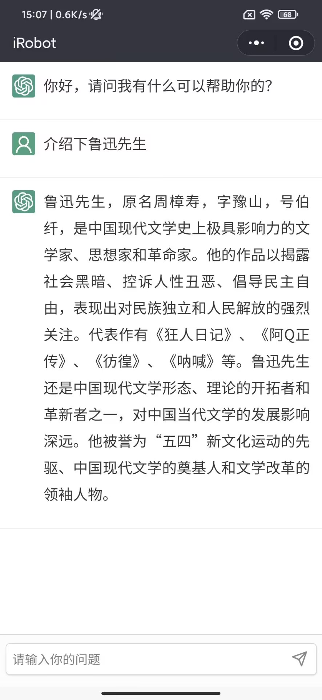
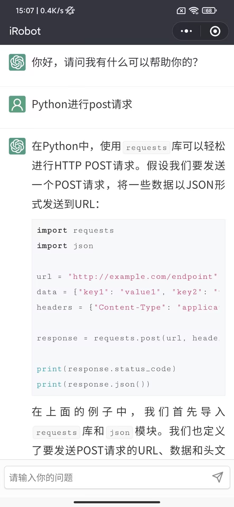
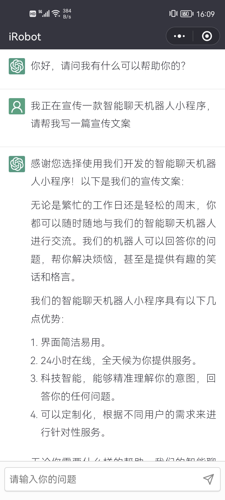

# iRobot聊天机器人

#### 介绍
"iRobot聊天机器人"是一款基于GPT3.5-Turbo开发的智能聊天小程序，提供知识问答、文案创作和代码编写等功能，支持上下文对话。

#### 功能亮点

- 基于GPT3.5模型，功能强大；
- 支持高亮显示代码和其他文本；
- 支持连续对话；
- 免费使用。

#### 体验示例
示例一：知识百科
  
示例二：代码编写

示例三：文案创作

#### 欢迎体验

